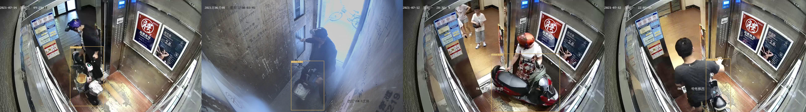

---
frameworks:
- Pytorch
license: Apache License 2.0
tasks:
- domain-specific-object-detection
model_type:
- my-custom-model
domain:
- cv
tags:
- Alibaba
- IoT
widgets:
  - task: domain-specific-object-detection
    enable: true
    model_revision: v1.0.0
    inputs:
      - type: image
        title: 电动车检测
    examples:
      - name: 1
        inputs:
          - data: git://resources/1.jpg
      - name: 2
        inputs:
          - data: git://resources/2.jpg
    inferencespec:
      cpu: 2
      memory: 4000
---

<div align="center"></div>

# 实时电动车检测模型
输入一张图像，对其中的电动车进行检测，输出图片中所有目标的检测框、置信度和标签。


[视觉模型边缘+端侧部署指南](https://modelscope.cn/brand/view/ai_porting_kit)  

[阿里云免费0代码开发10+种主流芯片的c++硬件加速SDK/性能评估/寒武纪/瑞芯微/Sigmastar/算能/君正/清微/Nvidia/等其他主流芯片](https://iotedge.console.aliyun.com/algorithm/modelManage)  

部署问题加算法开发平台开发者联盟群钉钉：49280002751
<div align="left"></div>

## 模型描述
输入一张图像，对其中的电动车进行检测，输出图片中所有目标的检测框、置信度和标签。

| 类别ID | 类别名称 |
| ------------ | ------------ |
| 0 | ebike |

## 使用方式和范围
使用方式：
- 输入一张图像，对其中的电动车进行检测，输出图片中所有目标的检测框、置信度和标签。

目标场景:
1，监控场景

### 如何使用
在ModelScope框架上，提供输入图片，即可以通过简单的Pipeline调用

#### 推理代码范例
```python
from modelscope.pipelines import pipeline

pipe = pipeline('domain-specific-object-detection', 'IoT-Edge/EBike_Detection', model_revision='v1.0.0')
output = pipe('./0.jpg')
print(output)
```
#### Clone with HTTP
```bash
  git clone https://www.modelscope.cn/IoT-Edge/EBike_Detection.git
```
